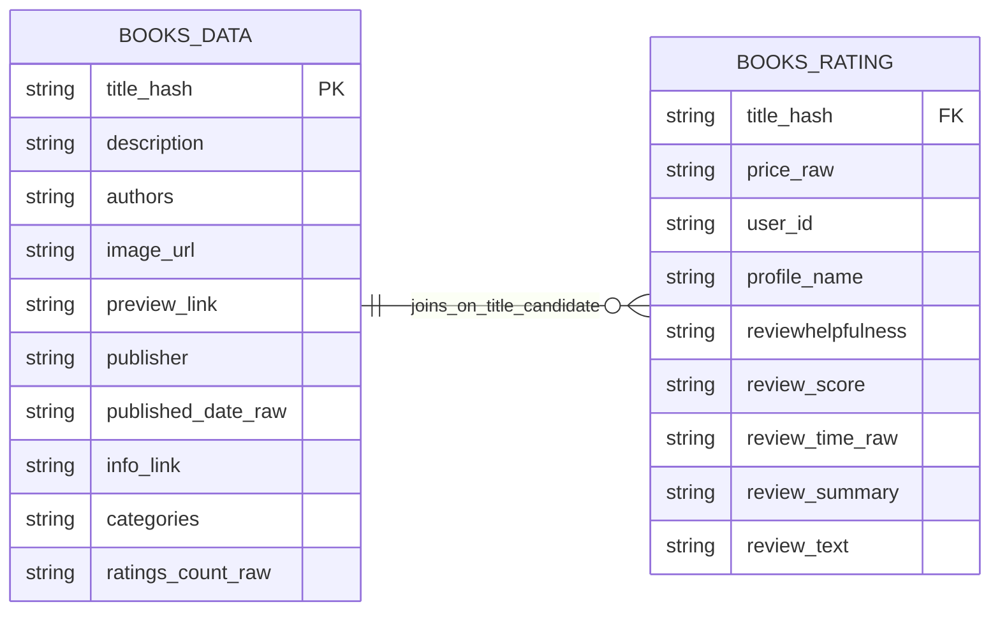

# Dui – Watcharapong Moonrin
Target Role: Data Engineer 
SQL-first career switcher with an IT and software development background, pivoting into a data career 

## 🧰 My Repo Code Stack

  

## What I'm focusing on
- Data Engineering: PySpark, Apache Airflow, ETL Pipeline Design, Data Modeling (Medallion Architecture) 
- Cloud & Big Data: Google Cloud Platform (GCS, BigQuery, Cloud Composer, Dataproc Serverless)  
- Data Processing: Python, PySpark DataFrame API, Databricks Environment, Parquet, Data Transformation, Data Validation  
- Orchestration & Runtime: Apache Airflow (DAG design), DataprocCreateBatchOperator, Kubernetes (Composer-managed 
environment) 
- Data Quality: Data validation, quality checks, quarantine handling, cross-table relationship validation 
- Databases & Querying: PostgreSQL, MySQL, SQL Server (CTEs, joins, window functions) 
- Runtime & Environment: Docker Compose, Cloud Shell, Linux CLI, environment-driven configuration 
- Tools: Git, Docker, VS Code, DBeaver 

## Featured Projects
- [Amazon Books Data Engineering Pipeline (End-to-End) — Databricks Edition](https://github.com/dui-w-moonrin/amazon-books-de-databricks/) 

## 🎯 Business Case

## Archetecture Diagram

### 🧱 Entity Relationship - ERD

## DAGS

## Timeline

## 📊 Data Studio (Looker Studio) Demo

[Demo](https://datastudio.google.com/s/o4eNN6GTweM)

## Connect with me
- [LinkedIn](https://www.linkedin.com/in/dui-w-moonrin/)
- [Credly](https://www.credly.com/users/dui-w-moonrin/)
